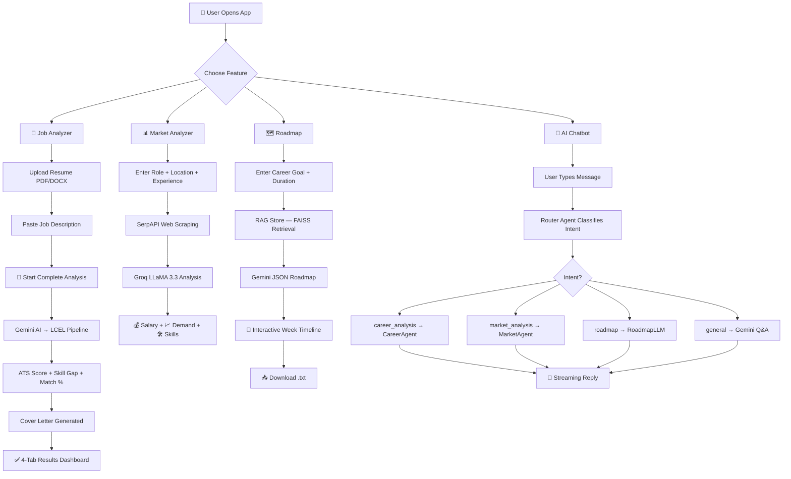

Readme header preview · HTML
Copy

<!DOCTYPE html>
<html lang="en">
<head>
<meta charset="UTF-8">
<meta name="viewport" content="width=device-width, initial-scale=1.0">
<title>AI Career Agent — README Header</title>
<style>
  @import url('https://fonts.googleapis.com/css2?family=Syne:wght@400;600;700;800&family=DM+Mono:wght@400;500&family=Instrument+Serif:ital@0;1&display=swap');
 
  *, *::before, *::after { box-sizing: border-box; margin: 0; padding: 0; }
 
  :root {
    --bg: #080b12;
    --surface: #0d1220;
    --border: rgba(255,255,255,0.06);
    --accent-1: #7c3aed;
    --accent-2: #06b6d4;
    --accent-3: #f59e0b;
    --text: #e2e8f0;
    --muted: #64748b;
  }
 
  body {
    background: var(--bg);
    color: var(--text);
    font-family: 'Syne', sans-serif;
    min-height: 100vh;
    display: flex;
    flex-direction: column;
    align-items: center;
    padding: 60px 24px;
    overflow-x: hidden;
  }
 
  /* ── GRID BACKGROUND ── */
  body::before {
    content: '';
    position: fixed;
    inset: 0;
    background-image:
      linear-gradient(rgba(124,58,237,0.04) 1px, transparent 1px),
      linear-gradient(90deg, rgba(124,58,237,0.04) 1px, transparent 1px);
    background-size: 48px 48px;
    pointer-events: none;
  }
 
  /* ── GLOW ORBS ── */
  .orb {
    position: fixed;
    border-radius: 50%;
    filter: blur(120px);
    pointer-events: none;
    opacity: 0.18;
  }
  .orb-1 { width: 500px; height: 500px; background: var(--accent-1); top: -150px; left: -100px; }
  .orb-2 { width: 400px; height: 400px; background: var(--accent-2); bottom: -100px; right: -80px; }
 
  /* ── CONTAINER ── */
  .header {
    position: relative;
    max-width: 860px;
    width: 100%;
    text-align: center;
  }
 
  /* ── EYEBROW ── */
  .eyebrow {
    display: inline-flex;
    align-items: center;
    gap: 8px;
    font-family: 'DM Mono', monospace;
    font-size: 11px;
    font-weight: 500;
    letter-spacing: 0.18em;
    text-transform: uppercase;
    color: var(--accent-2);
    background: rgba(6,182,212,0.08);
    border: 1px solid rgba(6,182,212,0.2);
    border-radius: 100px;
    padding: 6px 16px;
    margin-bottom: 32px;
    animation: fadeUp 0.6s ease both;
  }
  .eyebrow::before { content: '◈'; font-size: 10px; }
 
  /* ── TITLE ── */
  .title {
    font-size: clamp(52px, 8vw, 88px);
    font-weight: 800;
    line-height: 0.95;
    letter-spacing: -0.03em;
    animation: fadeUp 0.6s 0.1s ease both;
    margin-bottom: 6px;
  }
  .title-line-1 {
    display: block;
    color: #fff;
  }
  .title-line-2 {
    display: block;
    font-family: 'Instrument Serif', serif;
    font-style: italic;
    font-weight: 400;
    font-size: clamp(44px, 7vw, 76px);
    background: linear-gradient(135deg, var(--accent-1), var(--accent-2));
    -webkit-background-clip: text;
    -webkit-text-fill-color: transparent;
    background-clip: text;
  }
 
  /* ── TAGLINE ── */
  .tagline {
    font-family: 'DM Mono', monospace;
    font-size: 13px;
    color: var(--muted);
    letter-spacing: 0.08em;
    margin-top: 20px;
    margin-bottom: 48px;
    animation: fadeUp 0.6s 0.2s ease both;
  }
  .tagline span { color: var(--accent-3); }
 
  /* ── DIVIDER ── */
  .divider {
    width: 1px;
    height: 40px;
    background: linear-gradient(to bottom, transparent, var(--accent-1), transparent);
    margin: 0 auto 48px;
    animation: fadeUp 0.6s 0.3s ease both;
  }
 
  /* ── TECH STACK ── */
  .stack-label {
    font-family: 'DM Mono', monospace;
    font-size: 10px;
    letter-spacing: 0.2em;
    text-transform: uppercase;
    color: var(--muted);
    margin-bottom: 16px;
    animation: fadeUp 0.6s 0.35s ease both;
  }
 
  .stack-grid {
    display: flex;
    flex-wrap: wrap;
    justify-content: center;
    gap: 10px;
    margin-bottom: 48px;
    animation: fadeUp 0.6s 0.4s ease both;
  }
 
  .tech-pill {
    display: inline-flex;
    align-items: center;
    gap: 8px;
    padding: 8px 16px;
    border-radius: 8px;
    font-family: 'DM Mono', monospace;
    font-size: 12px;
    font-weight: 500;
    letter-spacing: 0.05em;
    border: 1px solid;
    transition: transform 0.2s ease, box-shadow 0.2s ease;
    cursor: default;
    position: relative;
    overflow: hidden;
  }
  .tech-pill::before {
    content: '';
    position: absolute;
    inset: 0;
    background: currentColor;
    opacity: 0;
    transition: opacity 0.2s ease;
  }
  .tech-pill:hover { transform: translateY(-2px); }
  .tech-pill:hover::before { opacity: 0.06; }
 
  .pill-fastapi  { color: #00d084; border-color: rgba(0,208,132,0.25); background: rgba(0,208,132,0.06); }
  .pill-react    { color: #61dafb; border-color: rgba(97,218,251,0.25); background: rgba(97,218,251,0.06); }
  .pill-gemini   { color: #a78bfa; border-color: rgba(167,139,250,0.25); background: rgba(167,139,250,0.06); }
  .pill-groq     { color: #fb923c; border-color: rgba(251,146,60,0.25);  background: rgba(251,146,60,0.06); }
  .pill-langchain{ color: #34d399; border-color: rgba(52,211,153,0.25);  background: rgba(52,211,153,0.06); }
  .pill-python   { color: #fbbf24; border-color: rgba(251,191,36,0.25);  background: rgba(251,191,36,0.06); }
 
  .tech-icon { font-size: 14px; }
 
  /* ── META BADGES ── */
  .meta-row {
    display: flex;
    flex-wrap: wrap;
    justify-content: center;
    gap: 8px;
    margin-bottom: 56px;
    animation: fadeUp 0.6s 0.5s ease both;
  }
  .meta-badge {
    display: inline-flex;
    align-items: center;
    gap: 6px;
    font-family: 'DM Mono', monospace;
    font-size: 11px;
    padding: 5px 12px;
    border-radius: 6px;
    letter-spacing: 0.06em;
  }
  .badge-active  { background: rgba(16,185,129,0.12); color: #10b981; border: 1px solid rgba(16,185,129,0.2); }
  .badge-mit     { background: rgba(124,58,237,0.12);  color: #a78bfa; border: 1px solid rgba(124,58,237,0.2); }
  .badge-prs     { background: rgba(236,72,153,0.12);  color: #f472b6; border: 1px solid rgba(236,72,153,0.2); }
  .badge-love    { background: rgba(239,68,68,0.12);   color: #f87171; border: 1px solid rgba(239,68,68,0.2);  }
  .badge-dot { width: 6px; height: 6px; border-radius: 50%; background: currentColor; animation: pulse 2s infinite; }
 
  /* ── DESCRIPTION ── */
  .description-card {
    position: relative;
    padding: 32px 40px;
    border: 1px solid var(--border);
    border-radius: 16px;
    background: var(--surface);
    text-align: left;
    overflow: hidden;
    animation: fadeUp 0.6s 0.6s ease both;
  }
  .description-card::before {
    content: '';
    position: absolute;
    top: 0; left: 0; right: 0;
    height: 1px;
    background: linear-gradient(90deg, transparent, var(--accent-1), var(--accent-2), transparent);
  }
  .description-card::after {
    content: '"';
    position: absolute;
    top: -20px; right: 24px;
    font-family: 'Instrument Serif', serif;
    font-size: 120px;
    color: var(--accent-1);
    opacity: 0.08;
    line-height: 1;
  }
 
  .desc-inner {
    display: flex;
    gap: 24px;
    align-items: flex-start;
  }
  .desc-accent-bar {
    flex-shrink: 0;
    width: 3px;
    height: 100%;
    min-height: 80px;
    background: linear-gradient(to bottom, var(--accent-1), var(--accent-2));
    border-radius: 2px;
    align-self: stretch;
  }
  .desc-text {
    font-family: 'Syne', sans-serif;
    font-size: 15px;
    line-height: 1.75;
    color: #94a3b8;
  }
  .desc-text strong {
    color: #fff;
    font-weight: 700;
  }
  .desc-text em {
    color: var(--accent-2);
    font-style: normal;
  }
 
  /* ── FEATURE PILLS ── */
  .features {
    display: flex;
    flex-wrap: wrap;
    gap: 8px;
    margin-top: 20px;
  }
  .feature-tag {
    font-family: 'DM Mono', monospace;
    font-size: 11px;
    padding: 4px 10px;
    border-radius: 4px;
    background: rgba(124,58,237,0.08);
    border: 1px solid rgba(124,58,237,0.15);
    color: #a78bfa;
    letter-spacing: 0.04em;
  }
 
  /* ── ANIMATIONS ── */
  @keyframes fadeUp {
    from { opacity: 0; transform: translateY(20px); }
    to   { opacity: 1; transform: translateY(0); }
  }
  @keyframes pulse {
    0%, 100% { opacity: 1; }
    50% { opacity: 0.3; }
  }
 
  /* ── README CODE SECTION ── */
  .code-section {
    margin-top: 80px;
    width: 100%;
    max-width: 860px;
  }
  .code-label {
    font-family: 'DM Mono', monospace;
    font-size: 11px;
    letter-spacing: 0.15em;
    text-transform: uppercase;
    color: var(--muted);
    margin-bottom: 12px;
    padding-left: 4px;
  }
  .code-block {
    background: var(--surface);
    border: 1px solid var(--border);
    border-radius: 12px;
    overflow: hidden;
  }
  .code-topbar {
    display: flex;
    align-items: center;
    gap: 8px;
    padding: 12px 16px;
    border-bottom: 1px solid var(--border);
    background: rgba(255,255,255,0.02);
  }
  .code-dot { width: 10px; height: 10px; border-radius: 50%; }
  .cd-r { background: #ff5f57; }
  .cd-y { background: #febc2e; }
  .cd-g { background: #28c840; }
  .code-filename {
    font-family: 'DM Mono', monospace;
    font-size: 11px;
    color: var(--muted);
    margin-left: 8px;
  }
  pre {
    padding: 24px;
    overflow-x: auto;
    font-family: 'DM Mono', monospace;
    font-size: 12px;
    line-height: 1.7;
    color: #94a3b8;
    white-space: pre;
  }
  .kw { color: #a78bfa; }
  .str { color: #34d399; }
  .cm { color: #475569; }
  .tag { color: #61dafb; }
  .attr { color: #fbbf24; }
  .url { color: #fb923c; }
</style>
</head>
<body>
 
<div class="orb orb-1"></div>
<div class="orb orb-2"></div>
 
<!-- ═══════════════════════════════════════════════
     LIVE PREVIEW
═══════════════════════════════════════════════ -->
<div class="header">
 
  <div class="eyebrow">Open Source · Full-Stack AI Platform</div>
 
  <h1 class="title">
    <span class="title-line-1">AI Career</span>
    <span class="title-line-2">Agent</span>
  </h1>
 
  <p class="tagline">Your career, <span>unlocked</span> — land your dream job faster ✦</p>
 
  <div class="divider"></div>
 
  <p class="stack-label">Built with</p>
  <div class="stack-grid">
    <span class="tech-pill pill-fastapi"><span class="tech-icon">⚡</span>FastAPI</span>
    <span class="tech-pill pill-react"><span class="tech-icon">⚛</span>React</span>
    <span class="tech-pill pill-gemini"><span class="tech-icon">✦</span>Google Gemini</span>
    <span class="tech-pill pill-groq"><span class="tech-icon">∞</span>Groq LLaMA</span>
    <span class="tech-pill pill-langchain"><span class="tech-icon">⛓</span>LangChain</span>
    <span class="tech-pill pill-python"><span class="tech-icon">🐍</span>Python</span>
  </div>
 
  <div class="meta-row">
    <span class="meta-badge badge-active"><span class="badge-dot"></span>Status · Active</span>
    <span class="meta-badge badge-mit">⚖ License · MIT</span>
    <span class="meta-badge badge-prs">↗ PRs · Welcome</span>
    <span class="meta-badge badge-love">♥ Made with love</span>
  </div>
 
  <div class="description-card">
    <div class="desc-inner">
      <div class="desc-accent-bar"></div>
      <div>
        <p class="desc-text">
          <strong>AI Career Agent</strong> is a full-stack intelligent career platform built for
          <em>Gen Z students</em> and early-career professionals. Upload your resume, drop a job
          description, and let AI do the heavy lifting —
          <em>ATS scores</em>, skill gap analysis, market insights, personalized roadmaps,
          and a built-in career chatbot.
        </p>
        <div class="features">
          <span class="feature-tag">ATS Scoring</span>
          <span class="feature-tag">Skill Gap Analysis</span>
          <span class="feature-tag">Market Insights</span>
          <span class="feature-tag">Career Roadmaps</span>
          <span class="feature-tag">AI Chatbot</span>
        </div>
      </div>
    </div>
  </div>
 
</div>
 
<!-- ═══════════════════════════════════════════════
     README MARKDOWN CODE
═══════════════════════════════════════════════ -->
<div class="code-section">
  <p class="code-label">↓ Copy this into your README.md</p>
  <div class="code-block">
    <div class="code-topbar">
      <div class="code-dot cd-r"></div>
      <div class="code-dot cd-y"></div>
      <div class="code-dot cd-g"></div>
      <span class="code-filename">README.md</span>
    </div>
    <pre id="readme-code"></pre>
  </div>
</div>
 
<script>
const code = `<span class="cm">&lt;!-- ══════════════════════════════════════════ --&gt;
&lt;!--              HEADER SECTION              --&gt;
&lt;!-- ══════════════════════════════════════════ --&gt;</span>
 
<span class="tag">&lt;div</span> <span class="attr">align</span>=<span class="str">"center"</span><span class="tag">&gt;</span>
 
<span class="cm">&lt;!-- Animated title --&gt;</span>
<span class="tag">&lt;img</span> <span class="attr">src</span>=<span class="str">"<span class="url">https://readme-typing-svg.demolab.com?font=Syne&weight=800&size=52&duration=2800&pause=1200&color=7C3AED&center=true&vCenter=true&width=750&lines=AI+Career+Agent;Your+Career%2C+Unlocked+✦;Land+Your+Dream+Job</span>"</span>
     <span class="attr">alt</span>=<span class="str">"AI Career Agent"</span> <span class="tag">/&gt;</span>
 
<span class="tag">&lt;br/&gt;</span>
 
<span class="cm">&lt;!-- Elegant italic subtitle --&gt;</span>
<span class="tag">&lt;img</span> <span class="attr">src</span>=<span class="str">"<span class="url">https://readme-typing-svg.demolab.com?font=Instrument+Serif&style=italic&size=22&duration=4000&pause=2000&color=06B6D4&center=true&vCenter=true&width=600&lines=Full-stack+AI+platform+for+Gen+Z+%26+early-career+pros</span>"</span>
     <span class="attr">alt</span>=<span class="str">"tagline"</span> <span class="tag">/&gt;</span>
 
<span class="tag">&lt;br/&gt;&lt;br/&gt;</span>
 
<span class="cm">&lt;!-- ── Tech Stack ── --&gt;</span>
<span class="tag">&lt;p&gt;</span>
  <span class="tag">&lt;img</span> <span class="attr">src</span>=<span class="str">"https://img.shields.io/badge/⚡_FastAPI-00D084?style=for-the-badge&labelColor=0d1220&color=0d1220&logoColor=00D084"</span> <span class="tag">/&gt;</span>
  <span class="tag">&lt;img</span> <span class="attr">src</span>=<span class="str">"https://img.shields.io/badge/⚛_React-61DAFB?style=for-the-badge&labelColor=0d1220&color=0d1220&logoColor=61DAFB"</span> <span class="tag">/&gt;</span>
  <span class="tag">&lt;img</span> <span class="attr">src</span>=<span class="str">"https://img.shields.io/badge/✦_Gemini-A78BFA?style=for-the-badge&labelColor=0d1220&color=0d1220"</span> <span class="tag">/&gt;</span>
  <span class="tag">&lt;img</span> <span class="attr">src</span>=<span class="str">"https://img.shields.io/badge/∞_Groq_LLaMA-FB923C?style=for-the-badge&labelColor=0d1220&color=0d1220"</span> <span class="tag">/&gt;</span>
  <span class="tag">&lt;img</span> <span class="attr">src</span>=<span class="str">"https://img.shields.io/badge/⛓_LangChain-34D399?style=for-the-badge&labelColor=0d1220&color=0d1220"</span> <span class="tag">/&gt;</span>
  <span class="tag">&lt;img</span> <span class="attr">src</span>=<span class="str">"https://img.shields.io/badge/🐍_Python-FBBF24?style=for-the-badge&labelColor=0d1220&color=0d1220"</span> <span class="tag">/&gt;</span>
<span class="tag">&lt;/p&gt;</span>
 
<span class="tag">&lt;br/&gt;</span>
 
<span class="cm">&lt;!-- ── Meta badges ── --&gt;</span>
<span class="tag">&lt;p&gt;</span>
  <span class="tag">&lt;img</span> <span class="attr">src</span>=<span class="str">"https://img.shields.io/badge/●_Status-Active-10b981?style=flat-square&labelColor=0d1220"</span> <span class="tag">/&gt;</span>
  &amp;nbsp;
  <span class="tag">&lt;img</span> <span class="attr">src</span>=<span class="str">"https://img.shields.io/badge/⚖_License-MIT-a855f7?style=flat-square&labelColor=0d1220"</span> <span class="tag">/&gt;</span>
  &amp;nbsp;
  <span class="tag">&lt;img</span> <span class="attr">src</span>=<span class="str">"https://img.shields.io/badge/↗_PRs-Welcome-ec4899?style=flat-square&labelColor=0d1220"</span> <span class="tag">/&gt;</span>
  &amp;nbsp;
  <span class="tag">&lt;img</span> <span class="attr">src</span>=<span class="str">"https://img.shields.io/badge/♥_Made_with-Love-ef4444?style=flat-square&labelColor=0d1220"</span> <span class="tag">/&gt;</span>
<span class="tag">&lt;/p&gt;</span>
 
<span class="tag">&lt;br/&gt;</span>
 
<span class="cm">&lt;!-- ── Description card (uses blockquote for the sidebar) ── --&gt;</span>
<span class="tag">&gt;</span> <span class="str">**AI Career Agent**</span> is a full-stack intelligent career platform built for
<span class="tag">&gt;</span> Gen Z students and early-career professionals. Upload your resume, drop a job
<span class="tag">&gt;</span> description, and let AI do the heavy lifting —
<span class="tag">&gt;</span> \`ATS scores\` · \`Skill gap analysis\` · \`Market insights\` · \`Personalized roadmaps\` · \`Career chatbot\`
 
<span class="tag">&lt;/div&gt;</span>
 
---`;
 
document.getElementById('readme-code').innerHTML = code;
</script>
 
</body>
</html>
## ✨ Features at a Glance

<table>
<tr>
<td width="50%">

### 📄 Resume & Job Analyzer
- **ATS Score** — instant compatibility check
- **Skill Gap Analysis** — matching vs missing skills
- **Match Percentage** — resume ↔ job alignment
- **Selection Probability** — AI-powered hiring chance

</td>
<td width="50%">

### 💼 Cover Letter Generator
- Tailored to the job description
- Professional tone with customization
- Copy, Download & Print directly
- Uses your real resume context

</td>
</tr>
<tr>
<td width="50%">

### 📊 Market Intelligence
- Salary ranges (India 🇮🇳 + Global 🌍)
- Current demand level & future scope
- Core, tools, nice-to-have & declining skills
- Powered by live web scraping + Groq LLaMA

</td>
<td width="50%">

### 🗺️ Learning Roadmap
- Week-by-week interactive timeline
- Phase breakdown (Beginner → Advanced)
- Mini-projects for each week
- Pro tips + expected outcomes
- Download as `.txt`

</td>
</tr>
<tr>
<td colspan="2">

### 🧠 Unified AI Chatbot (bottom-right widget)
Routes every message to the right agent automatically:
`Resume Q&A` → `Market Lookup` → `Roadmap Preview` → `General Career Q&A`

</td>
</tr>
</table>

---

## 🏗️ App Architecture

```
┌─────────────────────────────────────────────────────────────────┐
│                        USER (Browser)                           │
│                   React Frontend (Port 3000)                    │
│  ┌──────────┐ ┌──────────┐ ┌──────────┐ ┌──────────┐ ┌──────┐ │
│  │Dashboard │ │  Job     │ │ Market   │ │ Roadmap  │ │ Chat │ │
│  │ (Bento) │ │Analyzer  │ │Analyzer  │ │Generator │ │Widget│ │
│  └──────────┘ └──────────┘ └──────────┘ └──────────┘ └──────┘ │
└───────────────────────────┬─────────────────────────────────────┘
                            │  HTTP / Streaming (REST API)
                            ▼
┌─────────────────────────────────────────────────────────────────┐
│                    FastAPI Backend (Port 8000)                   │
│  ┌────────────────────────────────────────────────────────────┐ │
│  │                     API Endpoints                          │ │
│  │  POST /upload_resume   POST /analyze_resume                │ │
│  │  POST /generate_cover_letter   POST /api/market_analysis   │ │
│  │  POST /api/get_roadmap   POST /api/chat                    │ │
│  └──────────┬──────────┬───────────┬─────────────┬───────────┘ │
│             │          │           │             │             │
│      ┌──────▼──┐ ┌─────▼──┐ ┌─────▼───┐ ┌──────▼──────┐     │
│      │ Career  │ │ Market │ │ Roadmap │ │  Chatbot    │     │
│      │  Agent  │ │ Agent  │ │   LLM   │ │  Router     │     │
│      │(Gemini) │ │(Groq)  │ │(Gemini) │ │  Agent      │     │
│      └──────┬──┘ └─────┬──┘ └───┬─────┘ └──────┬──────┘     │
│             │          │        │               │             │
│      ┌──────▼──────────▼────────▼───────────────▼──────────┐ │
│      │          LangChain LCEL Pipelines                    │ │
│      │   Pydantic Models │ RAG (FAISS) │ Web Scraping       │ │
│      └──────────────────────────────────────────────────────┘ │
└─────────────────────────────────────────────────────────────────┘
```

---

## 🔄 Working Workflow



---

## 🛠️ Tech Stack

| Layer | Technology |
|-------|-----------|
| **Frontend** | React 18, React Router, Framer Motion, Lucide React |
| **Styling** | Vanilla CSS (Space Grotesk + Inter fonts, glassmorphism) |
| **Backend** | Python 3.11+, FastAPI, Uvicorn |
| **LLMs** | Google Gemini (primary), Groq LLaMA 3.3 (market) |
| **AI Framework** | LangChain LCEL, Pydantic v2, PydanticOutputParser |
| **RAG Pipeline** | FAISS vector store, LangChain text splitters |
| **Web Scraping** | SerpAPI, BeautifulSoup4, httpx |
| **Notifications** | React Toastify |
| **State** | React useState/useEffect (no Redux) |
| **Streaming** | FastAPI StreamingResponse → Fetch ReadableStream |

---

## 📁 Project Structure

```
AI Career Agent/
├── 📂 backend/
│   ├── main.py                   # FastAPI app + all endpoints
│   ├── .env                      # API keys (never commit!)
│   ├── 📂 agents/
│   │   ├── job_anayzer_agent.py  # CareerAgent (LCEL + Pydantic)
│   │   ├── market_insights_agent.py
│   │   ├── Roadmap_agent.py      # RAG + JSON roadmap
│   │   └── chatbot_router_agent.py  # Intent classifier + responder
│   ├── 📂 prompts/
│   │   ├── roadmap_prompt.txt    # JSON-structured
│   │   ├── chatbot_router_prompt.txt
│   │   ├── market_prompts.txt
│   │   └── job_anaylzer/         # unified, ats, cover_letter prompts
│   ├── 📂 scraping/
│   │   └── market_insights_scraping.py
│   ├── 📂 rag_Store/
│   │   └── ingest_roadmap.py     # FAISS ingestion
│   └── 📂 utils/
│       ├── llm_utils.py
│       ├── rag_chain.py
│       └── response_formetter.py
│
└── 📂 frontend/
    ├── 📂 src/
    │   ├── App.js                # Router + ChatWidget global
    │   ├── App.css               # Global design system tokens
    │   ├── 📂 pages/
    │   │   ├── Dashboard.jsx     # Bento grid landing
    │   │   ├── JobAnalyzer.jsx   # 4-tab analyzer
    │   │   ├── MarketAnalyzer.jsx
    │   │   └── RoadMap.jsx       # Interactive timeline
    │   ├── 📂 components/
    │   │   ├── Navbar/
    │   │   ├── ChatWidget/       # Floating AI chatbot
    │   │   ├── ResumeUploader/
    │   │   ├── JobDescriptionForm/
    │   │   ├── SkillsAnalysis/
    │   │   ├── ATSRecommendations/
    │   │   └── CoverLetterGenerator/
    │   └── 📂 Styles/            # Dark theme CSS per page
    └── package.json
```

---

## 🚀 Quick Start

### Prerequisites

- **Python 3.11+**
- **Node.js 18+**
- API keys: `GEMINI_API_KEY`, `GROQ_API_KEY`, `SERPAPI_API_KEY`

### 1️⃣ Clone the repo

```bash
git clone https://github.com/ankiiitraj/AI-Career-Agent.git
cd "AI Career Agent"
```

### 2️⃣ Backend Setup

```bash
cd backend

# Create virtual environment
python -m venv venv
venv\Scripts\activate        # Windows
source venv/bin/activate     # macOS/Linux

# Install dependencies
pip install -r requirements.txt

# Create .env file
```

Create `backend/.env`:
```env
GEMINI_API_KEY=your_gemini_key_here
GROQ_API_KEY=your_groq_key_here
SERPAPI_API_KEY=your_serpapi_key_here   # Optional — for live market data
```

```bash
# Start backend
cd backend
uvicorn main:app --reload --port 8000
```

> ✅ Backend running at `http://localhost:8000`  
> 📖 API docs at `http://localhost:8000/docs`

### 3️⃣ Frontend Setup

```bash
cd frontend
npm install
npm start
```

> ✅ Frontend running at `http://localhost:3000`

---

## 🔑 API Keys Guide

| Key | Where to Get | Required? |
|-----|-------------|-----------|
| `GEMINI_API_KEY` | [Google AI Studio](https://aistudio.google.com/app/apikey) | ✅ Yes |
| `GROQ_API_KEY` | [console.groq.com](https://console.groq.com) | ✅ Yes |
| `SERPAPI_API_KEY` | [serpapi.com](https://serpapi.com) | ⚡ Optional (market data) |

---

## 📡 API Endpoints

| Method | Endpoint | Description |
|--------|----------|-------------|
| `POST` | `/upload_resume` | Upload PDF/DOCX resume |
| `POST` | `/analyze_resume` | Full analysis (ATS + skills +match) |
| `POST` | `/generate_cover_letter` | AI cover letter |
| `POST` | `/api/market_analysis` | Market insights for a role |
| `POST` | `/api/get_roadmap` | Week-by-week learning roadmap |
| `POST` | `/api/chat` | Unified AI chatbot (streaming) |
| `GET`  | `/health` | Backend health check |
| `DELETE` | `/clear_data` | Wipe all stored data |

---

## 🎨 UI Design System

The frontend uses a custom **Gen Z dark theme**:

- 🎨 **Colours** — Neon purple `#7c3aed`, hot pink `#ec4899`, electric cyan `#06b6d4`
- 🪟 **Glassmorphism** — `rgba(255,255,255,0.04)` cards with blur
- ✨ **Aurora BG** — radial gradient blobs behind all pages
- 🅰️ **Fonts** — `Space Grotesk` (headings) + `Inter` (body)
- 💫 **Animations** — Framer Motion page transitions, Lucide icons

---

## 🤝 Contributing

1. Fork the repo
2. Create a feature branch: `git checkout -b feature/amazing-thing`
3. Commit changes: `git commit -m 'feat: add amazing thing'`
4. Push: `git push origin feature/amazing-thing`
5. Open a Pull Request 🎉

---

## 📄 License

MIT License — see [LICENSE](LICENSE) for details.

---

<div align="center">

Made with 💜 by **Ankit** · Powered by **Google Gemini** + **Groq LLaMA** + **LangChain**

<br/>

⭐ **If this helped you, drop a star!** ⭐

</div>
