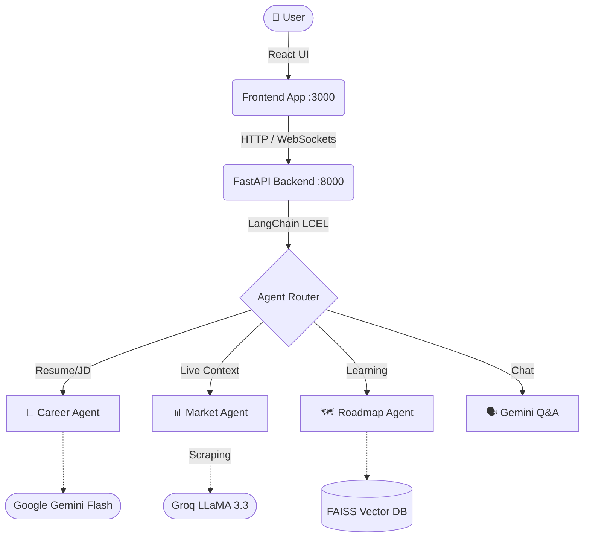

<div align="center">


<br/>

<p align="center">
  
  
  
  
  
  
</p>

<p align="center">
  
  
  
</p>

<br/>

> **AI Career Agent** is a full-stack, AI-powered career intelligence platform designed for students and modern professionals. 
> Upload your resume and job description to instantly receive ATS optimization, skill gap analysis, live market insights, AI-generated cover letters, and personalized learning roadmaps.

</div>

---

## ✨ Capabilities

| Feature | Description |
|---|---|
| 📄 **Smart Resume Analysis** | Instantly match your uploaded resume (PDF/DOCX) against any Job Description. Retrieves an ATS Score, Skill Gap Analysis, and Selection Probability using LangChain and Gemini. |
| 💼 **Cover Letter Generator** | Generates an AI-tailored cover letter based on your exact experiences and the target job's requirements. |
| 📊 **Live Market Intelligence** | Fetches real-time salary, demand, and future scope using web scraping and Groq LLaMA 3.3. |
| 🗺️ **Learning Roadmaps** | Generates an interactive, week-by-week RAG-powered study plan complete with mini-projects. |
| 🧠 **Unified AI Chatbot** | A conversational agent that routes questions automatically. Ask anything from *"What's my ATS score?"* to *"What is a DevOps engineer?"* and get contextual, streamed responses. |

---

## 📚 Documentation Directory

For deep-dives into how the AI Career Agent is built, check out our comprehensive documentation in the `docs/` folder:

- 🏛️ **[Architecture overview](docs/architecture.md)** — Learn about the FastAPI + React setup and data flow.
- 📡 **[API Reference](docs/api_reference.md)** — Detailed definitions of our REST endpoints.
- 🤖 **[AI Agents Deep-Dive](docs/agents_overview.md)** — Discover how our 4 LangChain agents operate.
- 🐳 **[Deployment Guide](docs/deployment.md)** — Instructions on running the project using Docker.

---

## 🚀 Quick Start (Local Setup)

### Prerequisites
- **Python 3.11+**
- **Node.js 18+**
- API Keys: `GEMINI_API_KEY`, `GROQ_API_KEY`, `SERPAPI_API_KEY` (optional)

### 1. Clone & Install
```bash
git clone https://github.com/codexankiiit31/Student-Career-Analyser-Agent.git
cd "AI Career Agent"
```

### 2. Backend Setup
```bash
cd backend
python -m venv venv
venv\Scripts\activate        # Windows
# source venv/bin/activate   # macOS/Linux

pip install -r requirements.txt
```
Create a `backend/.env` file with your keys:
```env
GEMINI_API_KEY=your_key
GROQ_API_KEY=your_key
SERPAPI_API_KEY=your_key
```
Start the API:
```bash
uvicorn main:app --reload --port 8000
```
> API is now live at `http://localhost:8000`. Test via Interactive Docs at `http://localhost:8000/docs`.

### 3. Frontend Setup
```bash
cd ../frontend
npm install
npm start
```
> Explore the UI at `http://localhost:3000`.

---

## 🏗️ Architecture Flow



---

<div align="center">
Made with 💜 by <b>Ankit</b> · <i>Star this repository if it helped you!</i>
</div>
