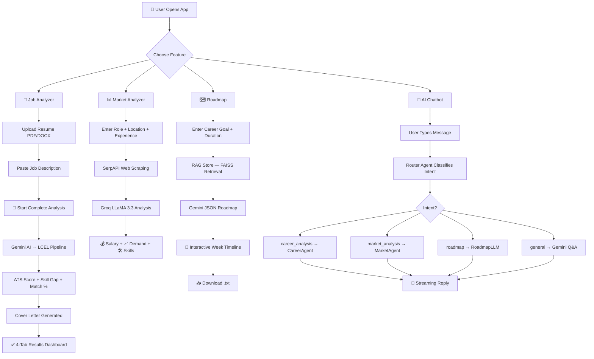

<div align="center">


<br/>

<p align="center">
  
  
  
  
  
  
</p>

<p align="center">
  
  
  
  
</p>

<br/>

> **AI Career Agent** is a full-stack intelligent career platform built for Gen Z students and early-career professionals. Upload your resume, drop a job description, and let AI do the heavy lifting — ATS scores, skill gap analysis, market insights, personalized roadmaps, and a built-in career chatbot.

</div>

---
## ✨ Features at a Glance

<table>
<tr>
<td width="50%">

### 📄 Resume & Job Analyzer
- **ATS Score** — instant compatibility check
- **Skill Gap Analysis** — matching vs missing skills
- **Match Percentage** — resume ↔ job alignment
- **Selection Probability** — AI-powered hiring chance

</td>
<td width="50%">

### 💼 Cover Letter Generator
- Tailored to the job description
- Professional tone with customization
- Copy, Download & Print directly
- Uses your real resume context

</td>
</tr>
<tr>
<td width="50%">

### 📊 Market Intelligence
- Salary ranges (India 🇮🇳 + Global 🌍)
- Current demand level & future scope
- Core, tools, nice-to-have & declining skills
- Powered by live web scraping + Groq LLaMA

</td>
<td width="50%">

### 🗺️ Learning Roadmap
- Week-by-week interactive timeline
- Phase breakdown (Beginner → Advanced)
- Mini-projects for each week
- Pro tips + expected outcomes
- Download as `.txt`

</td>
</tr>
<tr>
<td colspan="2">

### 🧠 Unified AI Chatbot (bottom-right widget)
Routes every message to the right agent automatically:
`Resume Q&A` → `Market Lookup` → `Roadmap Preview` → `General Career Q&A`

</td>
</tr>
</table>

---

## 🏗️ App Architecture

```
┌─────────────────────────────────────────────────────────────────┐
│                        USER (Browser)                           │
│                   React Frontend (Port 3000)                    │
│  ┌──────────┐ ┌──────────┐ ┌──────────┐ ┌──────────┐ ┌──────┐ │
│  │Dashboard │ │  Job     │ │ Market   │ │ Roadmap  │ │ Chat │ │
│  │ (Bento) │ │Analyzer  │ │Analyzer  │ │Generator │ │Widget│ │
│  └──────────┘ └──────────┘ └──────────┘ └──────────┘ └──────┘ │
└───────────────────────────┬─────────────────────────────────────┘
                            │  HTTP / Streaming (REST API)
                            ▼
┌─────────────────────────────────────────────────────────────────┐
│                    FastAPI Backend (Port 8000)                   │
│  ┌────────────────────────────────────────────────────────────┐ │
│  │                     API Endpoints                          │ │
│  │  POST /upload_resume   POST /analyze_resume                │ │
│  │  POST /generate_cover_letter   POST /api/market_analysis   │ │
│  │  POST /api/get_roadmap   POST /api/chat                    │ │
│  └──────────┬──────────┬───────────┬─────────────┬───────────┘ │
│             │          │           │             │             │
│      ┌──────▼──┐ ┌─────▼──┐ ┌─────▼───┐ ┌──────▼──────┐     │
│      │ Career  │ │ Market │ │ Roadmap │ │  Chatbot    │     │
│      │  Agent  │ │ Agent  │ │   LLM   │ │  Router     │     │
│      │(Gemini) │ │(Groq)  │ │(Gemini) │ │  Agent      │     │
│      └──────┬──┘ └─────┬──┘ └───┬─────┘ └──────┬──────┘     │
│             │          │        │               │             │
│      ┌──────▼──────────▼────────▼───────────────▼──────────┐ │
│      │          LangChain LCEL Pipelines                    │ │
│      │   Pydantic Models │ RAG (FAISS) │ Web Scraping       │ │
│      └──────────────────────────────────────────────────────┘ │
└─────────────────────────────────────────────────────────────────┘
```

---

## 🔄 Working Workflow



---

## 🛠️ Tech Stack

| Layer | Technology |
|-------|-----------|
| **Frontend** | React 18, React Router, Framer Motion, Lucide React |
| **Styling** | Vanilla CSS (Space Grotesk + Inter fonts, glassmorphism) |
| **Backend** | Python 3.11+, FastAPI, Uvicorn |
| **LLMs** | Google Gemini (primary), Groq LLaMA 3.3 (market) |
| **AI Framework** | LangChain LCEL, Pydantic v2, PydanticOutputParser |
| **RAG Pipeline** | FAISS vector store, LangChain text splitters |
| **Web Scraping** | SerpAPI, BeautifulSoup4, httpx |
| **Notifications** | React Toastify |
| **State** | React useState/useEffect (no Redux) |
| **Streaming** | FastAPI StreamingResponse → Fetch ReadableStream |

---

## 📁 Project Structure

```
AI Career Agent/
├── 📂 backend/
│   ├── main.py                   # FastAPI app + all endpoints
│   ├── .env                      # API keys (never commit!)
│   ├── 📂 agents/
│   │   ├── job_anayzer_agent.py  # CareerAgent (LCEL + Pydantic)
│   │   ├── market_insights_agent.py
│   │   ├── Roadmap_agent.py      # RAG + JSON roadmap
│   │   └── chatbot_router_agent.py  # Intent classifier + responder
│   ├── 📂 prompts/
│   │   ├── roadmap_prompt.txt    # JSON-structured
│   │   ├── chatbot_router_prompt.txt
│   │   ├── market_prompts.txt
│   │   └── job_anaylzer/         # unified, ats, cover_letter prompts
│   ├── 📂 scraping/
│   │   └── market_insights_scraping.py
│   ├── 📂 rag_Store/
│   │   └── ingest_roadmap.py     # FAISS ingestion
│   └── 📂 utils/
│       ├── llm_utils.py
│       ├── rag_chain.py
│       └── response_formetter.py
│
└── 📂 frontend/
    ├── 📂 src/
    │   ├── App.js                # Router + ChatWidget global
    │   ├── App.css               # Global design system tokens
    │   ├── 📂 pages/
    │   │   ├── Dashboard.jsx     # Bento grid landing
    │   │   ├── JobAnalyzer.jsx   # 4-tab analyzer
    │   │   ├── MarketAnalyzer.jsx
    │   │   └── RoadMap.jsx       # Interactive timeline
    │   ├── 📂 components/
    │   │   ├── Navbar/
    │   │   ├── ChatWidget/       # Floating AI chatbot
    │   │   ├── ResumeUploader/
    │   │   ├── JobDescriptionForm/
    │   │   ├── SkillsAnalysis/
    │   │   ├── ATSRecommendations/
    │   │   └── CoverLetterGenerator/
    │   └── 📂 Styles/            # Dark theme CSS per page
    └── package.json
```

---

## 🚀 Quick Start

### Prerequisites

- **Python 3.11+**
- **Node.js 18+**
- API keys: `GEMINI_API_KEY`, `GROQ_API_KEY`, `SERPAPI_API_KEY`

### 1️⃣ Clone the repo

```bash
git clone https://github.com/ankiiitraj/AI-Career-Agent.git
cd "AI Career Agent"
```

### 2️⃣ Backend Setup

```bash
cd backend

# Create virtual environment
python -m venv venv
venv\Scripts\activate        # Windows
source venv/bin/activate     # macOS/Linux

# Install dependencies
pip install -r requirements.txt

# Create .env file
```

Create `backend/.env`:
```env
GEMINI_API_KEY=your_gemini_key_here
GROQ_API_KEY=your_groq_key_here
SERPAPI_API_KEY=your_serpapi_key_here   # Optional — for live market data
```

```bash
# Start backend
cd backend
uvicorn main:app --reload --port 8000
```

> ✅ Backend running at `http://localhost:8000`  
> 📖 API docs at `http://localhost:8000/docs`

### 3️⃣ Frontend Setup

```bash
cd frontend
npm install
npm start
```

> ✅ Frontend running at `http://localhost:3000`

---

## 🔑 API Keys Guide

| Key | Where to Get | Required? |
|-----|-------------|-----------|
| `GEMINI_API_KEY` | [Google AI Studio](https://aistudio.google.com/app/apikey) | ✅ Yes |
| `GROQ_API_KEY` | [console.groq.com](https://console.groq.com) | ✅ Yes |
| `SERPAPI_API_KEY` | [serpapi.com](https://serpapi.com) | ⚡ Optional (market data) |

---

## 📡 API Endpoints

| Method | Endpoint | Description |
|--------|----------|-------------|
| `POST` | `/upload_resume` | Upload PDF/DOCX resume |
| `POST` | `/analyze_resume` | Full analysis (ATS + skills + match) |
| `POST` | `/generate_cover_letter` | AI cover letter |
| `POST` | `/api/market_analysis` | Market insights for a role |
| `POST` | `/api/get_roadmap` | Week-by-week learning roadmap |
| `POST` | `/api/chat` | Unified AI chatbot (streaming) |
| `GET`  | `/health` | Backend health check |
| `DELETE` | `/clear_data` | Wipe all stored data |

---

## 🎨 UI Design System

The frontend uses a custom **Gen Z dark theme**:

- 🎨 **Colours** — Neon purple `#7c3aed`, hot pink `#ec4899`, electric cyan `#06b6d4`
- 🪟 **Glassmorphism** — `rgba(255,255,255,0.04)` cards with blur
- ✨ **Aurora BG** — radial gradient blobs behind all pages
- 🅰️ **Fonts** — `Space Grotesk` (headings) + `Inter` (body)
- 💫 **Animations** — Framer Motion page transitions, Lucide icons

---

## 🤝 Contributing

1. Fork the repo
2. Create a feature branch: `git checkout -b feature/amazing-thing`
3. Commit changes: `git commit -m 'feat: add amazing thing'`
4. Push: `git push origin feature/amazing-thing`
5. Open a Pull Request 🎉

---

## 📄 License

MIT License — see [LICENSE](LICENSE) for details.

---

<div align="center">

Made with 💜 by **Ankit** · Powered by **Google Gemini** + **Groq LLaMA** + **LangChain**

<br/>

⭐ **If this helped you, drop a star!** ⭐

</div>
